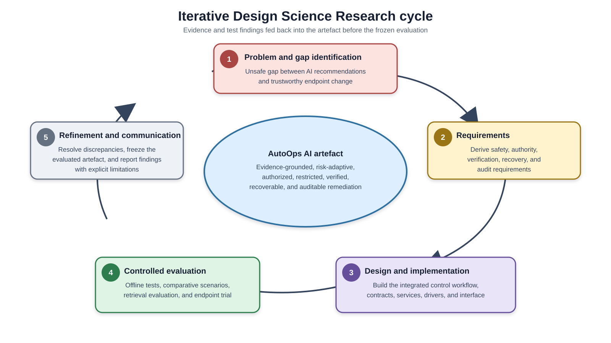
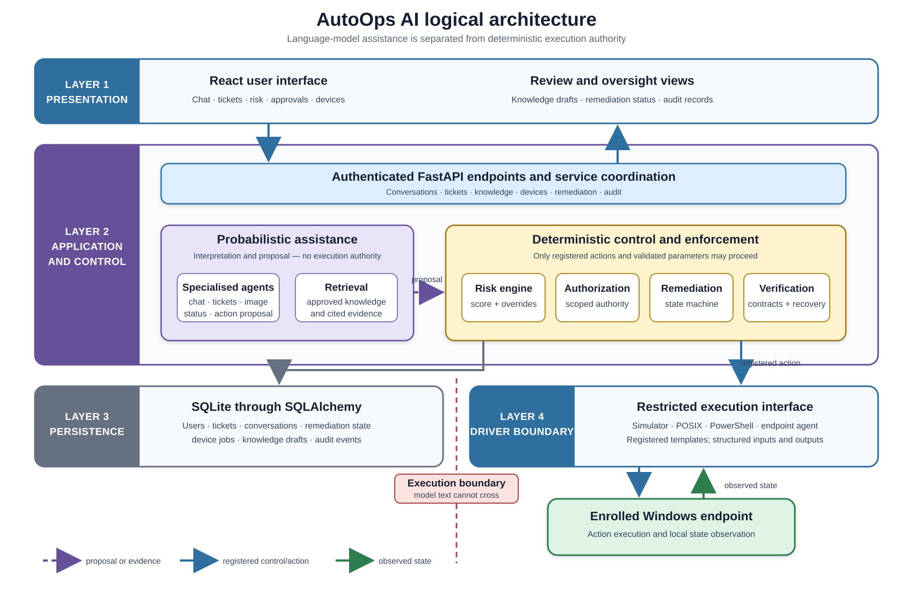
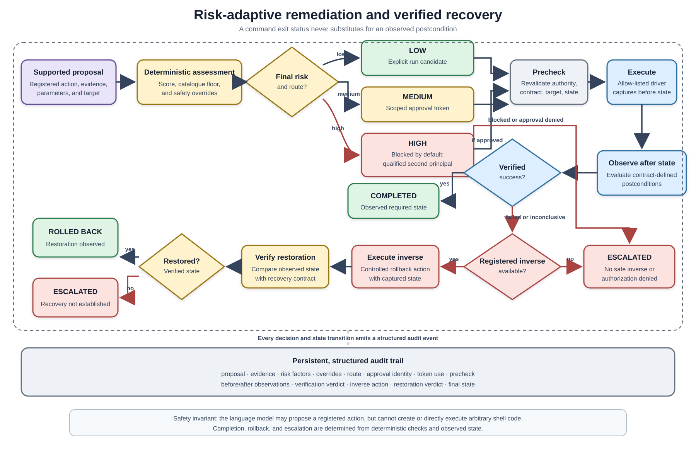

# Chapter 4 - Methodology

## 4.1 Chapter Overview

This chapter explains how AutoOps AI was designed, implemented, and evaluated. The method combined Design Science Research (DSR) with controlled software experimentation. It covers the research design, data and stakeholders, requirements, architecture, risk-adaptive policy, retrieval method, controlled execution and recovery workflow, implementation technologies, evaluation procedure, and ethical and security considerations. Observed outcomes are reported separately in Chapter 5.

## 4.2 Research Design and Justification

DSR was selected because the study addresses a practical information-systems problem by constructing and evaluating an artefact [26]. The artefact is the complete controlled-remediation workflow rather than only its language model or interface. It includes evidence retrieval, structured action proposals, deterministic risk assessment, authorization routing, pre-action checks, restricted execution, post-action verification, rollback or escalation, and persistent records.

The study followed four iterative activities: problem and gap identification; derivation of design requirements; artefact development; and controlled evaluation. Literature on intelligent support, tool-using agents, human oversight, runtime enforcement, and verified execution informed the requirements. Implementation and automated tests then exposed discrepancies between the design and observable behaviour. For example, real-device tests required verification to tolerate small natural changes in disk readings while still detecting material state changes. This feedback was used to refine the artefact before the final evaluation. Figure 4.1 presents the resulting iterative DSR cycle, including refinement and communication as the activity that closes the loop.

The research was primarily quantitative and engineering-oriented. It assessed rule conformance, execution decisions, observed state transitions, recovery behaviour, retrieval rankings, and trace completeness. No participant usability study was conducted. Consequently, the method evaluated specification conformance and limited operational feasibility, but not user acceptance or organisational effectiveness.

## 4.3 Data, Knowledge Sources, Scenarios, Devices, and Stakeholders

The prototype uses a JavaScript Object Notation (JSON) support dataset containing five sample users, five historical tickets, five user-history records, and 30 organisational-style knowledge articles. Each article contains an identifier, title, category, issue pattern, summary, resolution steps, and prior-use information. Verified remediations without an existing matching procedure may generate a knowledge draft. Such a draft remains excluded from retrieval until an authenticated reviewer approves it; rejected and pending drafts never become searchable.

The controlled evaluation corpus contains 32 unique scenarios: 30 risk and remediation cases plus two cases added to exercise recovery. The set contains low-, medium-, and high-risk expectations, cases with absent evidence, actions considered unsafe for autonomous execution, injected execution failures, and both successful and unsuccessful rollback paths. Scenario definitions contain fixed evidence scores, classifier confidence, action, parameters, initial simulated state, expected risk, expected route, and safety label. These labels were assigned by the researcher before execution. They therefore support a specification-conformance check, not independent expert validation.

The comparative experiment used a fresh in-memory database and simulated device state for every scenario, preventing one run from contaminating another. Separate endpoint tests exercised the same orchestration against an enrolled Windows device through a polling agent and PowerShell driver. The endpoint reported its own measurements; hardware-backed attestation was outside scope.

The represented stakeholders were end users, support personnel, expert or administrative approvers, and knowledge reviewers. No human participants were recruited. Stakeholder needs were represented through role permissions, approval states, literature-derived requirements, and test scenarios rather than interviews or questionnaires.

## 4.4 Requirements Identification and Analysis

Requirements were obtained from the research problem, the literature synthesis in Chapter 3, the original project scope, and iterative inspection and testing of the prototype. The principal functional requirements were to accept a support problem, retrieve relevant approved evidence, propose only registered actions, classify contextual risk, route authority, verify prerequisites, execute through a controlled driver, observe the outcome, recover or escalate on failure, and preserve the decision trail.

The main non-functional requirements were safety, explainability, auditability, reproducibility, and portability across execution environments. These produced several design constraints: model text must not become a shell command; missing contracts fail closed; deterministic policy retains execution authority; approval is narrow and time-limited; command completion is not resolution; and a recovery command is not accepted until restoration is observed. Long use cases and the full functional test matrix belong in the appendices.

## 4.5 Proposed Framework and Architecture

The system has four logical layers. The React interface presents chat, tickets, suggested actions, risk information, approvals, devices, knowledge review, and audit records. A FastAPI application exposes authenticated application programming interface (API) endpoints and coordinates ticket, conversation, device, remediation, and knowledge services. SQLite and SQLAlchemy persist users, tickets, conversations, remediation state, device jobs, knowledge drafts, and audit events. Execution drivers isolate the control workflow from the environment being changed.

Five specialised agent classes support conversation, ticket intelligence, ticket status, image analysis, and action recommendation/execution. However, the implemented orchestration is distributed across API handlers and services; it is not a set of five autonomous agents communicating through an independent agent platform. The language-model components classify and recommend, while the risk engine, remediation service, verification service, authorization checks, and drivers make and enforce execution decisions.

For local evaluation, the simulated driver provides controllable state and fault injection. Portable Operating System Interface (POSIX) and hybrid drivers support safe development diagnostics. The PowerShell driver supports registered Windows operations, while an agent driver queues a job for a specific enrolled endpoint. Every driver conforms to the same execution interface, allowing the risk and verification workflow to remain unchanged. Figure 4.2 shows these logical layers and distinguishes a probabilistic proposal from the registered action and observed-state paths that cross the controlled execution boundary.

## 4.6 Risk-Adaptive Remediation Design

Risk is calculated by a pure, deterministic service. Each factor has an ordinal value from 1 to 3, where a larger value contributes more risk. Positively stated confidence and evidence ratings are inverted once when the risk-factor object is created. The implemented score is:

\[
S = 0.30I + 0.20C + 0.20E + 0.15R + 0.15A
\]

where \(I\) is impact, \(C\) is diagnostic uncertainty, \(E\) is evidence weakness, \(R\) is irreversibility, and \(A\) is affected scope. Scores at or below 1.60 are low risk, scores above 1.60 and at or below 2.20 are medium risk, and higher scores are high risk. Table 4.1 identifies the implemented source and principal limitation of each signal.

**Table 4.1. Implemented risk signals and limitations**

| Factor | Implemented source and scale | Limitation |
| --- | --- | --- |
| Impact | Read-only contract = 1; otherwise action-catalogue low/medium/high = 1/2/3 | Mainly catalogue-derived, not a live impact measurement |
| Diagnostic uncertainty | LLM or fallback classifier confidence: >=0.85, >=0.65, or lower becomes confidence 3/2/1, then \(C=4-confidence\) | The language model supplies the confidence signal |
| Evidence weakness | Best citation similarity: >=0.80, >=0.70, or lower becomes quality 3/2/1, then \(E=4-quality\) | Measures best-match similarity, not authority, freshness, or corroboration |
| Irreversibility | Read-only or registered rollback = 1; no rollback = 2, or 3 for a high-catalogue-risk action | Determined from contracts and catalogue metadata |
| Affected scope | Read-only/own-device = 1; configured shared actions = 2 | No dynamic device or service dependency analysis |

Overrides may only raise risk. Missing required evidence, a privileged security action, an irreversible shared-resource change, or absent rollback on a critical resource forces high risk. The catalogue classification also acts as a floor. The assessment stores the factor vector, score-only class, final class, weights, policy version, overrides, route, and explanation so the decision can be replayed.

Low risk produces an automatic-execution candidate, medium risk waits for approval from the affected user or support personnel with explicit auto-resolution permission, and high risk is blocked unless a qualified second principal approves it. Low risk still requires an explicit run request and all preconditions; it is not unrestricted background autonomy. Approval creates a 15-minute, single-use token whose fingerprint covers the action, parameters, and target device. The approver identity is stored in the request, but it is separate from the token fingerprint.

## 4.7 Knowledge Retrieval and Controlled Learning

The retrieval path is implemented directly with the Gemini SDK rather than LangChain or ChromaDB. The configured default model is `gemini-embedding-001` [27]. The user's initial problem and newest message form the query. The query receives a retrieval-query embedding; each article's title and issue pattern receive retrieval-document embeddings. Vectors are cached in process and compared using cosine similarity.

A category match adds 0.05 to similarity. Matches above 0.70 are ranked using 80% similarity and 20% normalized prior-use count, and at most three citations are returned. Their identifiers, titles, categories, and similarity values accompany the answer and remediation record. A retrieval failure returns no citations instead of fabricating evidence; state-changing actions without required evidence are then raised to high risk. The current design does not chunk documents, persist a vector index, filter by environment metadata, or assess source freshness. Approved learned articles are merged into the searchable set, while unreviewed drafts remain isolated.

## 4.8 Controlled Execution, Verification, Rollback, and Escalation

The remediation state machine records proposal, assessment, approval, execution, verification, and recovery. A proposal stores the user, problem, diagnosis, citations, selected action, parameters, device, and action fingerprint. The executable allow-list consists of 26 action contracts. Each contract declares its state scope, required parameters, preconditions, postcondition, read-only status, and rollback availability. An unregistered action or free-form command cannot enter the verified route.

Immediately before execution, the verifier confirms that the action has a contract, the selected driver supports it, required parameters exist, evidence is sufficient where required, the risk fingerprint remains current, and approval is present. It then evaluates action-specific live-state conditions. Any failed mandatory check prevents the driver from running.

The driver captures the contract's relevant state before and after the operation. Postconditions compare these observations; the command's success flag alone never establishes resolution. Outcomes are `VERIFIED_SUCCESS`, `VERIFIED_FAILURE`, or `INCONCLUSIVE`. Only verified success completes the remediation. Otherwise, the service executes a registered inverse when one exists and verifies that rollback from observed state. Verified restoration produces `ROLLED_BACK`; an absent, failed, or unverified rollback produces `ESCALATED`. Audit events record the principal stages and associated structured metadata.

Startup-item recovery requires stronger evidence than observing that an item is enabled. The endpoint records whether the live and AutoOps backup values exist and computes Secure Hash Algorithm 256-bit (SHA-256) fingerprints of both command values locally. Raw startup commands do not leave the endpoint. A disable is verified only when the item is absent from the live Run key and its saved fingerprint matches the original fingerprint. Its inverse is verified only when the restored live fingerprint matches the pre-rollback backup fingerprint and the backup has been consumed. Missing or malformed records fail closed. This prevents an item that re-registered itself, or a rollback that changed nothing, from being reported as restored merely because the item was already enabled. Figure 4.3 summarizes the complete route from supported proposal to a verified terminal state and shows where the audit trail is retained.

## 4.9 Implementation Procedure and Technologies

The artefact was developed iteratively within the existing project. Python, FastAPI, Pydantic, SQLAlchemy, and SQLite implemented the backend and persistence. React and Vite implemented the browser interface. Gemini supported language processing and embeddings. Pytest provided rule, contract, API, service, driver, and evaluation-harness tests. Docker Compose provided a repeatable two-service deployment for the frontend and backend.

Development prioritized the research path: risk rules, persisted remediation states, verification contracts, execution drivers, scoped tokens, recovery, audit collection, controlled knowledge learning, and the evaluation harness. Predictive models and older action endpoints remained legacy application features and were excluded from the research comparison. Table 4.2 records the configuration used for the final evaluation.

**Table 4.2. Frozen implementation and evaluation configuration**

| Component | Final configuration |
| --- | --- |
| Source version | Commit `cc655c3411ea96e67740e04b9c36df47cdfba064`; tree `612f122e2f6514fc5d2716353a1c1fffd5c42751` |
| Core backend | Python 3.12; FastAPI 0.115.0; Pydantic 2.9.2; SQLAlchemy 2.0.35 |
| Frontend declarations | React 19.2.0; Vite 7.2.4 |
| Offline evaluation host | macOS 26.6.2, ARM64; Python 3.12.13; Pytest 8.3.3 |
| Retrieval | Gemini SDK 0.7.2; `models/gemini-embedding-001` |
| Windows endpoint | Windows 11 Home Single Language, version/build 10.0.26200/26200, 64-bit; PowerShell 5.1; Python 3.12.6 |
| Evaluation inputs | 32 scenarios; 30 retrieval queries; 30 knowledge articles |

## 4.10 Evaluation Procedure

The evaluation had four components. First, automated unit and integration tests examined factor validation, threshold boundaries, overrides, API authentication, token expiry and reuse, parameter and target binding, driver restrictions, preconditions, postconditions, rollback, device handling, knowledge review, and audit behaviour. The complete suite and a focused end-to-end safety selection were run from an archive of the frozen commit without the development `.env` or database. Outbound network access was blocked, placeholder provider keys were used, and a test guard failed any attempted language-model or embedding call. Console and JUnit outputs were retained.

Second, the 32 fixed scenarios were run three times under three conditions, producing 96 observations per condition and 288 records overall. Condition A recorded evidence and advice without execution. Condition B simulated uniform approval: every action was approved regardless of risk, so it represented an approval-all or rubber-stamp policy rather than observed human behaviour. Condition C applied the complete risk-adaptive policy. Fixed scenario signals and omission of the chat model made the comparison deterministic and avoided attributing language-model variation to the controller.

Measures included risk and route agreement with the author labels, unsafe cases executed or prevented, human approvals required, precheck failures, actions executed, verified outcomes, injected faults detected, rollback attempts and verified restorations, escalations, audit completeness, and stability across repeats. Rates were calculated with explicit numerators and denominators. The fault-detection denominator included only injected faults that reached execution. Verification and final status were also compared over the scenarios executed under both B and C because the policies produced different executed-case sets. Simulator durations were treated as controller or harness timing, not production user latency.

Third, retrieval was assessed once using a versioned set of 30 author-labelled paraphrased queries, one for each fixed knowledge article. Each record stored its supplied category, relevant article identifier, and label justification before execution. The query-set SHA-256 was `e373d94761351ca14db77e0ed44c1b8f78c46063bedf196a4305e1a1302d7389`; the 30-article dataset SHA-256 was `d9002cf4c60fe3c37bbd39aa3ab47f6bfb96e5a10344fd3f4b5dbaacf2c0d4ec`. Hit@1, Hit@3, mean reciprocal rank, no-result cases, ranking errors, score distributions, and retrieval-function timing were calculated. With explicit authorization, the live run sent only the 30 queries and each article's title plus issue pattern to Gemini; categories and all resolution, user, ticket, device, and secret data remained local. The author labels were not independently expert assessed.

Fourth, controlled end-to-end cases exercised the authenticated chat and remediation path through retrieval, proposal, deterministic assessment, approval, execution, observed-state verification, and completion or escalation. External language-model and embedding responses were fixed so controller behaviour remained repeatable, while the database, authentication, authorization, risk, action-contract, simulated driver, verification, and audit components remained active. Adversarial inputs placed a claimed approval in user text, an unknown-tool instruction in retrieved text, and an unknown action identifier in model-shaped output. These cases evaluated deterministic effect containment rather than universal prompt-injection immunity.

The endpoint procedure connected the Mac-hosted API to an enrolled Windows polling agent using the PowerShell driver. It first executed a names-only read-only startup diagnostic. A dedicated harmless Run value and a time-limited watcher then staged an application that re-registered itself after removal, allowing the controller to exercise observed failure and automatic recovery without changing a real application. A final diagnostic and direct registry check examined cleanup. Scenario definitions, CSV and JSON results, JUnit files, selected traces, environment metadata, recalculations, and SHA-256 manifests were retained in separate offline, retrieval, and Windows evidence packages.

## 4.11 Ethics, Privacy, Security, and Project Management

The study did not involve recruited participants, so it makes no usability, trust, or acceptance claims. The controlled harness used a fixed evaluation identity, isolated in-memory databases, and synthetic device state. Real-endpoint work was limited to a test device, a dedicated harmless startup value, read-only diagnostics, and registered actions. Any later user study would require the institution's approval, informed consent, and a separate data-management procedure.

Authenticated APIs, role checks, hashed device credentials, target ownership checks, allow-listed contracts, and short-lived single-use approval tokens reduce unauthorized execution. Medium-risk approval is restricted to the affected user or a role carrying the `troubleshoot:auto_resolve` permission. Retrieved passages and user messages are marked as untrusted data in model prompts; generated action identifiers are filtered through the fixed catalogue; and the remediation layer independently rejects actions without verification contracts. Service and API tests reject unrelated ordinary users and Support L1 personnel while permitting the owner and authorized Support L2 personnel. Nevertheless, the prototype retains important limitations. These controls constrain the effects of model output but do not establish universal prompt-injection immunity. Audit data is persistent and ordered but not cryptographically tamper-evident. An endpoint agent can report its own state without hardware attestation. External model and embedding calls also require deployment-specific controls over confidential support text.

Version control recorded design and implementation changes. The frozen commit, configuration, dependency versions, input hashes, operating systems, timestamps, and calculation procedures were included in the retained evidence. Credentials were excluded. The privacy-reduced Windows summary omitted real startup command values, while the raw local database remained outside the thesis.

## 4.12 Chapter Summary

This chapter defined the DSR-based construction and evaluation method for AutoOps AI. The implemented design separates probabilistic interpretation from deterministic authority and connects evidence retrieval, contextual risk, graded authorization, controlled execution, observed-state verification, recovery, and audit. The evaluation combined automated testing, a repeatable three-condition scenario experiment, live retrieval assessment, controlled end-to-end cases, and limited real-endpoint evidence. Chapter 5 reports the resulting artefact and observations within these methodological boundaries.
